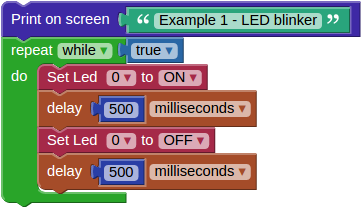
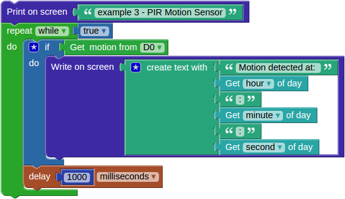
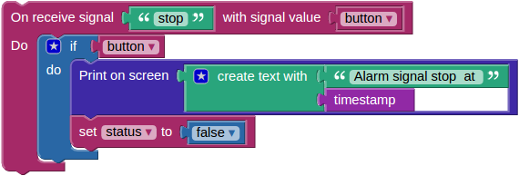

# Examples

TODO: add some generic wiering descriptions of the shield.

## Example 1 - LED blink

Every developer facing a new toy (development board) starts with simple tasks, like lighting a LED.

### Wiring

### Description

To light an LED we need the *Red Pitaya* > **Set Led** block. The first entry in the block is used to choose one of the eight yellow LEDs. The second entry specifies if the LED should be turned `ON` or `OFF`. In the example the first *Set Led* block turns the led `ON` while the second turns it `OFF`.

There are *Program* > *Timing* > **delay** blocks after *Set Led*. The first delay specifies for how long the LED will be shining, while the second delay specifies for how long the LED will be dark.

*Set Led* an *delay* blocks are wrapped into a *Program* > *Loops* > **repeat while []** block, this will repeat the LED `ON`, delay, LED `OFF`, delay sequence indefinitely, this causing the LED to blink.

### Experimentation

You can set another LED to blink instead of LED `0`, by changing the first entry in both *Set Led* blocks to a different number. If the two blocks are set to control different LEDs, then one LED will always shine, and the other will always be dark.

You can change the rhythm of blinking by changing the values in *delay* blocks. Try it and see what happens.

You can also change everything else. In most cases, the program will not work. If this happens, just undo your changes, and try something else.

## Example 2 - Buzzer

This example introduces *Dashboard* blocks. An on screen switch is used to turn a buzzer `ON` and `OFF`.

### Wiring

TODO: describe how the board can be attached to various connectors.

### Description

To sound the buzzer we need *Indicators* > *Buzzer* > **Set buzzer [] on pin []** block. We can set it to `HIGH` (buzzing) or `LOW` (silent). We also have to specify to which data signal the buzzer is connected, in out example this is `D0`, the first of 16 digital IO (input/output) signals.

The **Switch** block from the *Dashboard* generates a named signal each time it is toggled, additionally is sends the `ON` and `OFF` status after the change. To receive this signal the *Signal* > **On receive signal [] with signal value [] Do** block is used. The switch and the receiver must use the same signal name. When the switch is toggled the receiver will execute the code inside the block, but first it will set the variable `buzz_state` to the state of the switch. The *Program* > *Logic* > **if [] do [] else []** block is used to turn `HIGH` the buzzer only if the switch is set to `ON`, else the buzzer will be turned to `LOW`. 

### Experimentation

An important programming concept introduced in this example is a variable. Variables are used by programs to memorize numbers, ON/OFF states, text and many other things. When choosing a name for a variable, find something meaningful, so the name will remind you of the variables purpose. The same program can be used to control a LED, try to add a *Set Led* block, so it will shine while the buzzer is silent.

## Example 3 - PIR Motion Sensor

The previous examples only used indicators, LED and buzzer. This example is using an infra red sensor to detect motion, so the program knows, if somebody is moving in the sensors vicinity. The program will check for motion every second, and if the motion is detected it will report it by printing a line containing the current time on the screen.

### Wiring

### Description

An infinite loop with a 1 second delay at the end is used again. Inside the loop there is a *Program* > *Logic* > **if do** block, which will execute on the condition that the *Sensors* > *Motion sensor* > **get motion from** will return true. This will happen each time somebody is moving in the vicinity of the sensor. The sensor can be attached to various connectors on the shield, here the `D0` option is used as specified in the sensor block.

If the condition is true the *Program* > *Screen and keyboard* > **Write on screen** block will be executed. A text block must be placed inside, here the *Program* > *Text* > **create text with** is used to concatenate several short text strings into one longer. The first string "Motion detected at: " is never changing so it is placed inside the *Program* > *Text* > **" "** block. We also wish to print the actual time (hour:minute:second), blocks for this strings can be found inside *Program* > *Date and Hour* > **get of day**.

### Experimentation

Similar to indicators, sensors can also be attached to different shield connectors, here the `D0` connector is used, you can try attaching to a different connector and changing the number. This will become handy, when a combination of multiple sensors indicators will be used and it will not be possible to attach them to the same connector. You should also try changing the printed text, for example adding the date.

## Example 4 - Alarm

This example is a combination of previous examples. The PIR motion sensor will detect moving persons, while the LED and buzzer will be used to sound the alarm.

### Wiring

### Description

### Experimentation

Instead of sounding the alarm for 30 seconds, you could change it to sound until a button on screen is pressed, by using TODO.

## Example 5 - Temperature logger

This example shows how analog sensors can be used. The previous digital sensors only supported digital values like `ON/OFF`, `HIGH/LOW` or `1/0`. Analog sensor can provide a range of numbers like temperature, pressure, humidity, brightness, ... Another new feature described in this example is how to draw a graph of temperature changing over time.

### Wiring

### Description

### Experimentation

 

# Hardware

## Visual programming shield connectors

The black connectors on the sides are compatible with arduino, white connectors on the front provide analog inputs, and there are two rows of gray connectors at the center which provide digital I/O, UART, I2C or analog outputs.

In addition to general purpose connectors on the sides of the shield, there are dedicated connectors compatible with [Grove modules](http://www.seeedstudio.com/depot/category_products?themes_id=1417 "seeed Grove modules").

### Grove module connectors

| pin | CN8  | CN8  | CN18 | CN19 | CN20 | CN12 | CN7  | CN?? | CN22 | CN9  | CN10 | CN11 | CN13 | CN14 |
|-----|------|------|------|------|------|------|------|------|------|------|------|------|------|------|
| `0` | GND  | GND  | GND  | GND  | GND  | GND  | GND  | GND  | GND  | GND  | GND  | GND  | GND  | GND  |
| `1` | VCC  | VCC  | VCC  | VCC  | VCC  | VCC  | VCC  | VCC  | VCC  | VCC  | VCC  | VCC  | VCC  | VCC  |
| `2` | TX   | SDA  | SDA  | SDA  | SDA  | AI3  | AI2  | AI1  | AO1  | IO1  | IO3  | IO5  | IO7  | IO9  |
| `3` | RX   | SCL  | SCL  | SCL  | SCL  | AI2  | AI1  | AI0  | AO0  | IO0  | IO2  | IO4  | IO6  | IO8  |
|     | UART | I2C  | I2C  | I2C  | I2C  | AI   | AI   | AI   | AO   | DIO  | DIO  | DIO  | DIO  | DIO  |

### Arduino compatible connectors

| function | pin | comment |
|----------|-----|---------|
| GND      | `0` |         |

## Red Pitaya connectors

While it is possible to connect sensors and indicators directly to Red Pitaya *E1* and *E2* connectors, it is recommended to use shields. They enable the user to connect multiple peripherals without improvised wiring. It is also possible for developers to create their own custom shields.

### E1 connector

Connector E1 provides 16 *GPIO* (general purpose input/output) signals. All GPIO can be used to read sensor data, or drive indicators.

| function |  pin |  pin | function |
|----------|-----:|-----:|----------|
| GND      | `26` | `25` | GND      |
| NC       | `24` | `23` | NC       |
| NC       | `22` | `21` | NC       |
| NC       | `20` | `19` | NC       |
| D[15]    | `18` | `17` | D[7]     |
| D[14]    | `16` | `15` | D[6]     |
| D[13]    | `14` | `13` | D[5]     |
| D[12]    | `12` | `11` | D[4]     |
| D[11]    | `10` | ` 9` | D[3]     |
| D[10]    | ` 8` | ` 7` | D[2]     |
| D[ 9]    | ` 6` | ` 5` | D[1]     |
| D[ 8]    | ` 4` | ` 3` | D[0]     |
| +3.3V    | ` 2` | ` 1` | +3.3V    |

### E2 connector

Connector E2 provides 4 *AI* (analog input) signals, 4 *AO* (analog output) signals and signals for serial protocols *UART*, *SPI* and *I2C*. Analog inputs can be used to connect analog sensors. Analog outputs can be used to drive some indicators. Serial protocols can be used to connect more complex sensors, indicators and other peripherals.

| function |  pin |  pin | function |
|----------|-----:|-----:|----------|
| GND      | `26` | `25` | GND      |
| ADC_CLK- | `24` | `23` | ADC_CLK+ |
| GND      | `22` | `21` | GND      |
| AO[3]    | `20` | `19` | AO[2]    |
| AO[1]    | `18` | `17` | AO[0]    |
| AI[3]    | `16` | `15` | AI[2]    |
| AI[1]    | `14` | `13` | AI[0]    |
| I2C_GND  | `12` | `11` | common   |
| I2C SDA  | `10` | ` 9` | I2C_SCK  |
| UART_RX  | ` 8` | ` 7` | UART_TX  |
| SPI_CS   | ` 6` | ` 5` | SPI_CLK  |
| SPI_MISO | ` 4` | ` 3` | SPI_MOSI |
| -4V      | ` 2` | ` 1` | +5V      |

## Sensors and Indicators

Grove sensors from Seed
http://www.seeedstudio.com/

PIR Motion sensor
[[http://www.seeedstudio.com/wiki/Grove_-_PIR_Motion_Sensor]]

Buzzer
[[http://www.seeedstudio.com/wiki/Grove_-_Buzzer]]

Sound sensor
[[http://www.seeedstudio.com/wiki/Grove_-_Sound_Sensor]]

# Software

## Red Pitaya blocks

